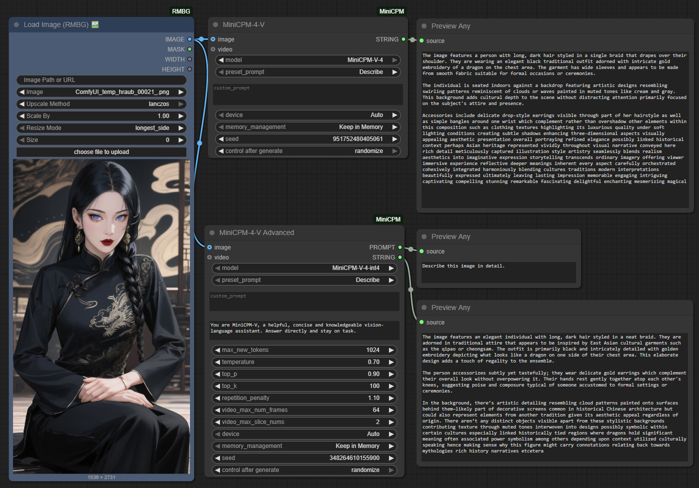
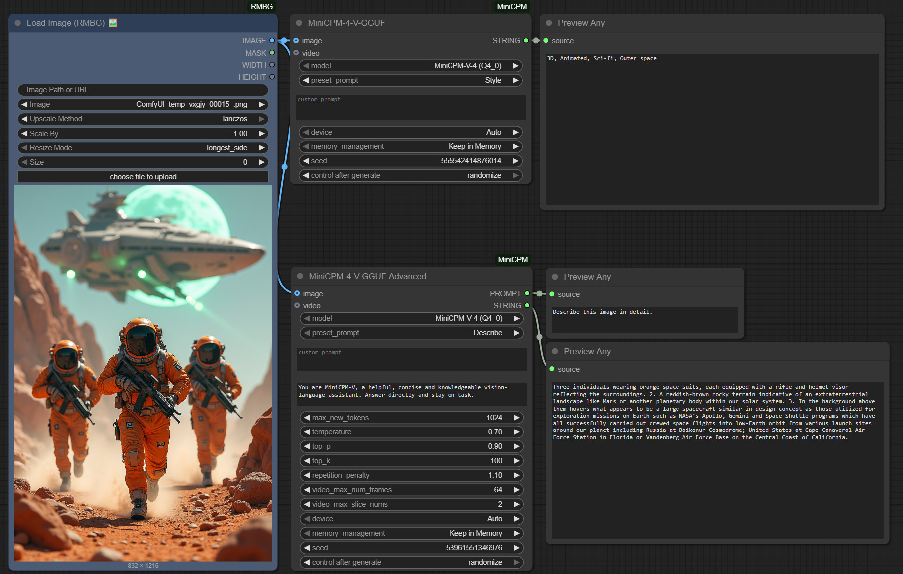
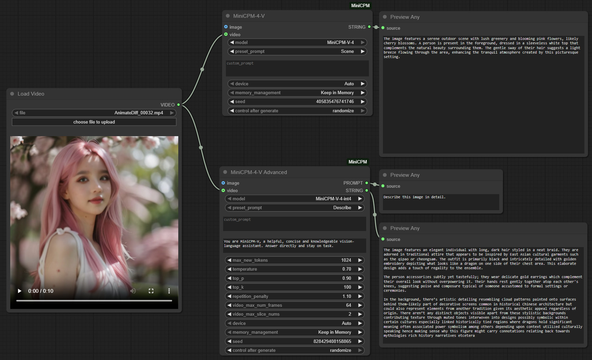
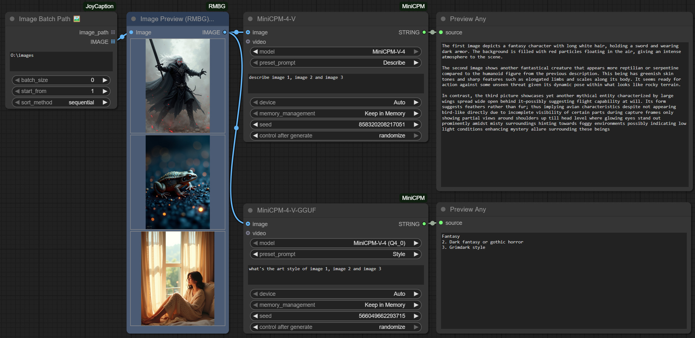

# ComfyUI-MiniCPM Update Log
## V1.1.1 (2025-08-28)
- **Internationalization (i18n) Support**: Added support for multiple languages, including EN, FR, JP, KO, RU, ZH.
- **Updated Example Workflows**: Revised and expanded example workflows for improved clarity and usability.
- **Renaming of Custom Nodes**: Enhanced organization and naming conventions for custom nodes to improve structure and readability.
- **Expanded Preset Prompts**: Added additional preset prompts to increase flexibility and functionality.
## V1.1.0 (2025-08-27)
### New Features

- **MiniCPM-V-4.5 Model Support**: Added comprehensive support for the latest MiniCPM-V-4.5 models
  - New Transformers model: `MiniCPM-V-4.5` (openbmb/MiniCPM-V-4_5) - Latest full precision version
  - New quantized model: `MiniCPM-V-4.5-int4` (openbmb/MiniCPM-V-4_5-int4) - Memory-efficient 4-bit version
- **Performance Improvements**: Added hf_xet dependency for faster downloads
- **Model Priority**: V4.5 models now appear first in dropdown menus

### Changes
- V4.5 GGUF models temporarily disabled due to llama-cpp-python 3.16 compatibility
- Enhanced error messages for unsupported models
- Improved model ordering and descriptions

### Usage Notes
- **Recommended**: Use MiniCPM-V-4.5 Transformers models for latest features and enhanced capabilities
- **Alternative**: Continue using MiniCPM-V-4.0 GGUF models (all quantizations available, see table above)
- **Coming Soon**: V4.5 GGUF support will be restored once llama-cpp-python compatibility is resolved

## V1.0.0 (2025-08-25)
### Initial Release
- **MiniCPM-V-4 Transformers Support**: Full integration with Hugging Face transformers models

  - MiniCPM-V-4 full precision model
  - MiniCPM-V-4-int4 quantized model
- **MiniCPM-V-4 GGUF Support**: Comprehensive GGUF model support via llama-cpp-python

  - Multiple quantization levels (Q4_0 to Q8_0)
  - Optimized memory usage and performance
- **Dual Node Architecture**: 
  - Basic nodes for simple usage
  - Advanced nodes with full parameter control
- **Image & Video Processing**: Support for both image and video input processing

- **Memory Management**: Three modes - Keep in Memory, Clear After Run, Global Cache
- **Caption Types**: 14 different preset prompt types for various use cases
- **Legacy Compatibility**: Backward compatible node for existing workflows

### Core Features
- **Multi-Modal Processing**: Image and video content understanding
- **Flexible Parameters**: Customizable temperature, top-p, top-k, repetition penalty
- **Auto-Download**: Automatic model downloading from Hugging Face
- **Cross-Platform**: Windows, macOS, and Linux support
- **CUDA Acceleration**: GPU acceleration support for faster inference

- **System Prompts**: Customizable system prompts for different use cases
